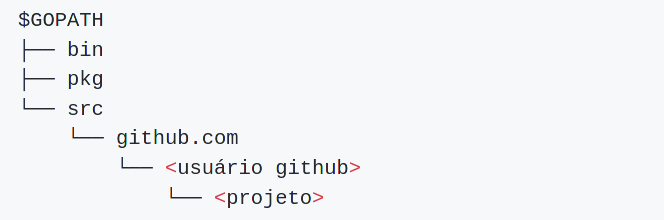

# Dia 03

## Concorrência


### Goroutines

Em Go cada atividade que executa de forma concorrênte é chamada de  *`goroutine`*. 

Normalmente desenvolver software com programação concorrente nunca é simples, mas Go tornou isso mais fácil do que em outras linguagens.
A criação de de uma thread **também chamada de goroutine** é praticamente trivial no dia a dia do desenvolvedor.

No exemplo abaixo podemos ver como é feita a chamada de uma goroutine.

```go
package main

func exempleGoroutine(str string) {
    for i := 1; i < 3; i++ {
        fmt.Printf("%s: %d", str, i)
    }
}

func main() {
    exempleGoroutine("direto") // espera que ela retorne
    go exempleGoroutine("com go routine") //cria uma goroutine e não espara que retorne.
}
```

### Canais (channels)

Se goroutines são atividades de um programa concorrênte, canais(channels) são as conexões entre elas. Um canal é uma sistema de comunicação que permite a uma goroutine enviar valores para outra goroutine.

Canal é um condutor de valores de um tipo particular, chamados de *tipo de elemento* do canal.

```go
package main


func main() {
	sendDataToChannel()
}

func sendDataToChannel() {
	ch := make(chan int, 1)
	ch <- 1 //enviando dados para um canal
	<-ch

	ch <- 2
	fmt.Println(<-ch)
}

```

```go
package main


func main() {
	sendDataToChannel()
}

func sendDataToChannel() {
	ch := make(chan int)
	ch <- 1 //enviando dados para um canal
	<-ch

	ch <- 2
	fmt.Println(<-ch)
}

```

```go
func doisTresQuatroVezes(base int, c chan int) {
	time.Sleep(time.Second)
	c <- 2 * base // enviando dados para o canal

	time.Sleep(time.Second)
	c <- 3 * base

	time.Sleep(3 * time.Second)
	c <- 4 * base
}
func main() {
	c := make(chan int)
	go doisTresQuatroVezes(2, c)

	a, b := <-c, <-c // recebendo os dados do canal
	fmt.Println(a, b)

	fmt.Println(<-c)
}
```
### Defer

TODO

### WaitGroup

TODO

## Pacotes

TODO


## Go Modules: Gerenciamento de Dependências

Nos últimos anos houve muita turbulência em torno do gerenciamento de dependências do Go. Surgiram diversas ferramentas, como [dep](https://golang.github.io/dep/), [godep](https://github.com/tools/godep), [govendor](https://github.com/kardianos/govendor) e um monte de outras, que entraram em cena para tentar resolver esse problema de uma vez por todas.

### O que é o Go Modules?

> É o novo sistema de gerenciamento de dependências do Go que torna explícita e fácil o gerenciamento das informações sobre versões de dependências
>> <cite>[The Go Blog - Using Go Modules][1]</cite>

Em poucas palavras, *Go Modules* é a resposta oficial para lidarmos com o **Gerenciamento de Dependências em Go**.

### GOPATH, um pouco de história

O lançamento da versão 1.13 possibilitou a criação do diretório do projeto em qualquer lugar no computador, inclusive no diretório `GOPATH`. Em versões pré-1.13 e pós-1.11, já era possível criar o diretório em qualquer lugar, porém o recomendado era criá-lo fora do diretório `GOPATH`.

Esta é uma grande mudança em relação as versões anteriores do Go (pré-1.11), onde a prática recomendada era criar o diretório dos projetos dentro de uma pasta `src` sob o diretório `GOPATH`, conforme mostrado a seguir:



Nessa estrutura, os diretórios possuem as seguintes funções:

- `bin`: Guardar os executáveis de nossos programas;
- `pkg`: Guardar nossas bibliotecas e bibliotecas de terceiros;
- `src`: Guardar todo o código dos nossos projetos.

De forma resumida:

- Versões pré-1.11: A recomendação é criar o diretório do projeto sob o diretório `GOPATH`;
- Versões pós-1.11 e pré-1.13: A recomendção é criar o diretório do projeto fora do `GOPATH`;
- Versão 1.13: O diretório do projeto pode ser criado em qualquer lugar no computador.

### Configuração do projeto e ativação do Go Modules

Para utilizar módulos no seu projeto, abra seu terminal e crie um novo diretório para o projeto chamado `buscacep` em qualquer lugar em seu computador.

> **Dica**: Crie o diretório do projeto em `$HOME/workshop`, mas você pode escolher um local diferente, se desejar.

```bash
$ mkdir -p $HOME/workshop/buscacep
```

A próxima coisa que precisamos fazer é informar ao Go que queremos usar a nova funcionalidade de módulos para ajudar a gerenciar e controlar a versão de quaisquer pacotes de terceiros que o nosso projeto importe.

Para fazer isso, primeiro precisamos decidir qual deve ser o caminho do módulo para o nosso projeto.

O importante aqui é a singularidade. Para evitar possíveis conflitos de importação com os pacotes de outras pessoas ou com a _Standard Library_ (biblioteca padrão) no futuro, escolha um caminho de módulo que seja globalmente exclusivo e improvável de ser usado por qualquer outra coisa. Na comunidade Go, uma convenção comum é criar o caminho do módulo com base em uma URL que você possui.

Se você estiver criando um pacote ou aplicativo que possa ser baixado e usado por outras pessoas e programas, é recomendável que o caminho do módulo seja igual ao local do qual o código pode ser baixado. Por exemplo, se o seu pacote estiver hospedado em `https://github.com/foo/bar`, o caminho do módulo para o projeto deverá ser `github.com/foo/bar`.

Supondo que estamos usando o [github](https://github.com), vamos iniciar os módulos da seguinte forma:

```bash
$ cd $HOME/workshop/buscacep
$ go mod init github.com/[SEU_USARIO_GITHUB]/buscacep

// Saída no console
go: creating new go.mod: module github.com/[SEU_USARIO_GITHUB]/buscacep
```

Neste ponto, o diretório do projeto já deve possuir o aquivo `go.mod` criado.

Não há muita coisa nesse arquivo e se você abrí-lo em seu editor de texto, ele deve ficar assim (**mas de preferência com seu próprio caminho de módulo exclusivo**):

```bash
module github.com/[SEU_USARIO_GITHUB]/buscacep

go 1.13
```

Basicamente é isso! Nosso projeto já está configurado e com o Go Modules habilitado.

### Referências

[1]:https://blog.golang.org/using-go-modules
- [Using Go Modules](https://blog.golang.org/using-go-modules)
- [Migrating to Go Modules](https://blog.golang.org/migrating-to-go-modules)
- [Publishing Go Modules](https://blog.golang.org/publishing-go-modules)
- [Go Modules: v2 and Beyond](https://blog.golang.org/v2-go-modules)


## Projeto

Como projeto final, vamos desenvolver uma API que vai funcionar como um proxy para alguns serviços de CEP.

A ideia é utilizar a concorrência do Go para realizar diversas requisições simultâneas para cada um dos serviços de CEP e pegar a resposta do serviço que responder mais rapidamente.

### API

Se você já está na área de TI (tecnologia da informação) há algum tempo, provavelmente já deve ter ouvido o termo API pelo menos uma vez. Mas, o que é essa API?

> _"API (do Inglês **Application Programming Interface**) é um conjunto de rotinas e padrões estabelecidos por um software para a utilização das suas funcionalidades por aplicativos que não pretendem envolver-se em detalhes da implementação do software, mas apenas usar seus serviços"_
>> <cite>[pt.wikipedia.org][1]</cite>

### API Rest

Atualmente, boa parte das APIs escritas são APIs web e tendem a seguir o estilo **Rest**.

#### O que é REST?

REST é acrônimo para **RE**presentational **S**tate **T**ransfer. É um estilo arquitetural para sistemas de hipermídia distribuídos e foi apresentado pela primeira vez por **Roy Fielding** em 2000 em sua famosa [dissertação](https://www.ics.uci.edu/~fielding/pubs/dissertation/rest_arch_style.htm).

### API em Go com net/HTTP

O suporte **HTTP** em Go é fornecido pelo pacote da biblioteca padrão `net/http`. Dito isso, vamos fazer a primeira iteração da nossa API.

Começaremos com os três itens essenciais:

- O primeiro item que precisamos é de um **manipulador** (ou ***`handler`***). Se você tem experiência com MVC, pode pensar em manipuladores (handlers) como sendo os controladores. Eles são responsáveis pela execução da lógica da aplicação e pela criação de cabeçalhos e do corpo da resposta HTTP.

- O segundo item é um roteador (ou **`servermux`** na terminologia do Go). Ele armazenará o mapeamento entre os padrões de URL da aplicação e os manipuladores (handlers) correspondentes. Normalmente temos um *servermux* para a aplicação contendo todas as rotas.

- O último item que precisamos é um servidor web. Uma das grandes vantagens do Go é que você pode estabelecer um servidor Web e tratar solicitações recebidas como parte da própria aplicação. Você não precisa de um servidor de terceiros como o Nginx ou o Apache.

Vamos juntar esses itens, os conceitos vistos até aqui e criar uma aplicação didática e funcional.

Primeiramente, acesse o diretório do projeto configurado anteriormente e crie um arquivo chamado `main.go`:

```bash
$ cd $HOME/workshop/buscacep
# a criação do arquivo pode ser realizada dentro da prória IDE / Editor de texto
$ touch main.go
```

E digite o código a seguir:

```go
// server01.go -> Referência para o arquivo no diretório exemplos
package main

import (
	"log"
	"net/http"
)

// Defina uma função manipuladora (handler) chamada "home" que escreve
// um slice de bytes contendo "Bem vindo a API de CEPs" no o corpo da resposta.
func home(w http.ResponseWriter, r *http.Request)  {
	w.Write([]byte("Bem vindo a API de CEPs"))
}

func main() {
	// Use a função http.NewServeMux() para inicializar um novo servermux,
	// depois registre a função "home" como manipulador do padrão de URL "/".
	mux := http.NewServeMux()
	mux.HandleFunc("/", home)

	// Use a função http.ListenAndServe() para iniciar um novo servidor web.
    // Passamos dois parâmetros: o endereço de rede TCP que será escutado
    // (neste caso ":4000") e o servermux que acabamos de criar.
    // Se http.ListenAndServe() retornar um erro, usamos a função
    // log.Fatal() para registrar a mensagem de erro e sair.
	log.Println("Iniciando o servidor na porta: 4000")
	err := http.ListenAndServe(":4000", mux)
	log.Fatal(err)
}
```

Considerando que você está no diretório onde está o arquivo `main.go`, para executar o código anterior, execute:

```bash
$ go run main.go
```

E para testar, abra o navegador e digite a URL `http://localhost:4000` ou execute o seguinte comando:

```bash
$ curl localhost:4000
```

#### Rotas parametrizadas

Quando acessamos a URL `/cep/04167001`, queremos obter informações sobre o CEP `04167001`. A primeira coisa a ser feita é obter o CEP a partir da URL e isso pode ser feito da seguinte maneira:

```go
// server02.go -> Referência para o arquivo no diretório exemplos
...
// novo - função manipuladora (hanlder)
func cepHandler(w http.ResponseWriter, r *http.Request) {
	cep := r.URL.Path[len("/cep/"):]
	w.Write([]byte(cep))
}

func main() {
	mux := http.NewServeMux()
    mux.HandleFunc("/", home)
    // novo padrão
	mux.HandleFunc("/cep/", cepHandler)

	log.Println("Iniciando o servidor na porta: 4000")
	err := http.ListenAndServe(":4000", mux)
	log.Fatal(err)
}
...
```

> ***Nota sobre rotas parametrizadas:** Go não suporta roteamento baseado em método ou URLs semânticos com variáveis (`/cep/{cep}`). Idealmente, não devemos verificar o caminho da URL dentro do nosso manipulador (handler), devemos usar alguma lib de terceiros que faça isso para nós.*

#### JSON

JSON (*JavaScript Object Notation*) é uma notação padrão para o envio e recebimento de informações estruturadas.

Sua simplicidade, legibilidade e suporte universal o tornam, atualmente, a notação mais amplamente utilizada.

Go tem um suporte excelente para codificação e decodificação de JSON oferecidos pelo pacote da biblioteca padrão `encoding/json`.

```go
// server03.go -> Referência para o arquivo no diretório exemplos
...
type cep struct {
	Cep        string `json:"cep"`
	Cidade     string `json:"cidade"`
	Bairro     string `json:"bairro"`
	Logradouro string `json:"logradouro"`
	UF         string `json:"uf"`
}
...
func cepHandler(w http.ResponseWriter, r *http.Request) {
	rCep := r.URL.Path[len("/cep/"):]
	c := cep{Cep: rCep}
	ret, err := json.Marshal(c)
	if err != nil {
		log.Printf("Ops! ocorreu um erro: %s", err.Error())
		http.Error(w, http.StatusText(http.StatusBadRequest), http.StatusBadRequest)
		return
	}
	w.Write([]byte(ret))
}
...
```

O processo de converter uma estrutura (`struct`) Go para JSON chama-se *marshaling* e , como visto, é feito por `json.Marshal`.

O resultado de uma chamada a nossa API pode ser algo semelhante ao JSON a seguir:

```json
{
   "cep":"04167001",
   "cidade":"",
   "bairro":"",
   "logradouro":"",
   "uf":""
}
```
Como pode ser percebido, nosso resultado apresenta campos vazios. 

Caso seja necessário, isso pode ser contornado por meio do uso da opção adicional `omitempty`: 

```go
// server04.go -> Referência para o arquivo no diretório exemplos
...
type cep struct {
	Cep        string `json:"cep"`
	Cidade     string `json:"cidade,omitempty"`
	Bairro     string `json:"bairro,omitempty"`
	Logradouro string `json:"logradouro,omitempty"`
	UF         string `json:"uf,omitempty"`
}
...
```

#### Cliente HTTP

Um cliente HTTP também pode ser criado com Go para consumir outros serviços com o mínimo de esforço. Como é mostrado no seguinte trecho de código, o código do cliente usa o tipo `http.Client` para se comunicar com o servidor:

```go
// server05.go -> Referência para o arquivo no diretório exemplos
...
var endpoints = map[string]string{
	"viacep":           "https://viacep.com.br/ws/%s/json/",
	"postmon":          "https://api.postmon.com.br/v1/cep/%s",
	"republicavirtual": "https://republicavirtual.com.br/web_cep.php?cep=%s&formato=json",
}
...
func cepHandler(w http.ResponseWriter, r *http.Request) {
	rCep := r.URL.Path[len("/cep/"):]

	endpoint := fmt.Sprintf(endpoints["postmon"], rCep)

	client := http.Client{Timeout: time.Duration(time.Millisecond * 600)}
	resp, err := client.Get(endpoint)
	if err != nil {
		log.Printf("Ops! ocorreu um erro: %s", err.Error())
		http.Error(w, http.StatusText(http.StatusInternalServerError), http.StatusInternalServerError)
		return
	}
	defer resp.Body.Close()

	requestContent, err := ioutil.ReadAll(resp.Body)
	if err != nil {
		log.Printf("Ops! ocorreu um erro: %s", err.Error())
		http.Error(w, http.StatusText(http.StatusInternalServerError), http.StatusInternalServerError)
		return
	}

	w.Write([]byte(requestContent))
}
...
```

#### Padronizando nosso retorno

Tudo lindo e maravilhoso, só que se analizarmos os retornos de cada serviço de CEP, veremos que existe uma certa divergência entre eles:

```json
// http://republicavirtual.com.br/web_cep.php?cep=01412100&formato=json
{
    "resultado": "1",
    "resultado_txt": "sucesso - cep completo",
    "uf": "SP",
    "cidade": "São Paulo",
    "bairro": "Cerqueira César",
    "tipo_logradouro": "Rua",
    "logradouro": "Augusta"
}

// http://api.postmon.com.br/v1/cep/01412100
{
    "complemento": "de 2440 ao fim - lado par",
    "bairro": "Cerqueira César",
    "cidade": "São Paulo",
    "logradouro": "Rua Augusta",
    "estado_info": {
        "area_km2": "248.221,996",
        "codigo_ibge": "35",
        "nome": "São Paulo"
    },
    "cep": "01412100",
    "cidade_info": {
        "area_km2": "1521,11",
        "codigo_ibge": "3550308"
    },
    "estado": "SP"
}

// https://viacep.com.br/ws/01412100/json/
{
  "cep": "01412-100",
  "logradouro": "Rua Augusta",
  "complemento": "de 2440 ao fim - lado par",
  "bairro": "Cerqueira César",
  "localidade": "São Paulo",
  "uf": "SP",
  "unidade": "",
  "ibge": "3550308",
  "gia": "1004"
}
```

Sendo assim, vamos tratar cada retorno e padronizá-lo:

```go
// server06.go -> Referência para o arquivo no diretório exemplos
...
func cepHandler(w http.ResponseWriter, r *http.Request) {
	rCep := r.URL.Path[len("/cep/"):]

	endpoint := fmt.Sprintf(endpoints["republicavirtual"], rCep)

	client := http.Client{Timeout: time.Duration(time.Millisecond * 600)}
	resp, err := client.Get(endpoint)
	if err != nil {
		log.Printf("Ops! ocorreu um erro: %s", err.Error())
		http.Error(w, http.StatusText(http.StatusInternalServerError), http.StatusInternalServerError)
		return
	}
	defer resp.Body.Close()

	requestContent, err := ioutil.ReadAll(resp.Body)
	if err != nil {
		log.Printf("Ops! ocorreu um erro: %s", err.Error())
		http.Error(w, http.StatusText(http.StatusInternalServerError), http.StatusInternalServerError)
		return
	}

	// Novo
	c, err := parseResponse(requestContent)
	if err != nil {
		log.Printf("Ops! ocorreu um erro: %s", err.Error())
		http.Error(w, http.StatusText(http.StatusInternalServerError), http.StatusInternalServerError)
		return
	}

	c.Cep = rCep
	ret, err := json.Marshal(c)
	if err != nil {
		log.Printf("Ops! ocorreu um erro: %s", err.Error())
		http.Error(w, http.StatusText(http.StatusInternalServerError), http.StatusInternalServerError)
		return
	}

	w.Write([]byte(ret))
}

func parseResponse(content []byte) (payload cep, err error) {
	response := make(map[string]interface{})
	_ = json.Unmarshal(content, &response)

	if err := isValidResponse(response); !err {
		return payload, errors.New("invalid response")
	}

	if _, ok := response["localidade"]; ok {
		payload.Cidade = response["localidade"].(string)
	} else {
		payload.Cidade = response["cidade"].(string)
	}

	if _, ok := response["estado"]; ok {
		payload.UF = response["estado"].(string)
	} else {
		payload.UF = response["uf"].(string)
	}

	if _, ok := response["logradouro"]; ok {
		payload.Logradouro = response["logradouro"].(string)
	}

	if _, ok := response["tipo_logradouro"]; ok {
		payload.Logradouro = response["tipo_logradouro"].(string) + " " + payload.Logradouro
	}

	payload.Bairro = response["bairro"].(string)

	return
}

func isValidResponse(requestContent map[string]interface{}) bool {
	if len(requestContent) <= 0 {
		return false
	}

	if _, ok := requestContent["erro"]; ok {
		return false
	}

	if _, ok := requestContent["fail"]; ok {
		return false
	}

	return true
}
...
```

#### Acertando o cabeçalho da reposta

Ao enviar uma resposta, o Go definirá automaticamente três cabeçalhos gerados pelo sistema para você: `Date`, `Content-Length` e `Content-Type`.

O cabeçalho `Content-Type` é particularmente interessante. O Go tentará definí-lo de maneira correta, analisando o corpo da resposta com a função `http.DetectContentType()`.

Se essa função não conseguir detectar o tipo de conteúdo, o cabeçalho será definido como `Content-Type: application/octet-stream`.

A função `http.DetectContentType()` geralmente funciona muito bem, mas uma dica para desenvolvedores Web novos no Go é que ela não consegue distinguir `JSON` de texto sem formatação. E, por padrão, as respostas `JSON` serão enviadas com um cabeçalho `Content-Type: text/plain; charset=utf-8`. Para impedir que isso aconteça, é necessário definir o cabeçalho correto manualmente da seguinte maneira:

```go
// server07.go -> Referência para o arquivo no diretório exemplos
...
func cepHandler(w http.ResponseWriter, r *http.Request) {
    ...
    // Acertando o cabeçalho
	w.Header().Set("Content-Type", "application/json")
	w.Write([]byte(ret))
}
...
```

#### Gran finale

Para finalizar, vamos adicionar um pouco de concorrência em nossa aplicação:

```go
// server08.go -> Referência para o arquivo no diretório exemplos
package main

import (
	...
	"regexp" // Novo
	"time"
)

type cep struct {
	...
}

// novo
func (c cep) exist() bool {
	return len(c.UF) != 0
}
...

// Função cepHandler foi refatorada e dela extraímos a função request  
func cepHandler(w http.ResponseWriter, r *http.Request) {
	// Restrigindo o acesso apenas pelo método GET
	if r.Method != http.MethodGet {
		http.Error(w, http.StatusText(http.StatusMethodNotAllowed), http.StatusMethodNotAllowed)
		return
	}

	rCep := r.URL.Path[len("/cep/"):]
	rCep, err := sanitizeCEP(rCep)
	if err != nil {
		http.Error(w, err.Error(), http.StatusBadRequest)
		return
	}

	ch := make(chan []byte, 1)
	for _, url := range endpoints {
		endpoint := fmt.Sprintf(url, rCep)
		go request(endpoint, ch)
	}

	w.Header().Set("Content-Type", "application/json")
	for index := 0; index < 3; index++ {
		cepInfo, err := parseResponse(<-ch)
		if err != nil {
			continue
		}

		if cepInfo.exist() {
			cepInfo.Cep = rCep
			json.NewEncoder(w).Encode(cepInfo)
			return
		}
	}

	http.Error(w, http.StatusText(http.StatusNoContent), http.StatusNoContent)
}

// novo
func request(endpoint string, ch chan []byte) {
	start := time.Now()

	c := http.Client{Timeout: time.Duration(time.Millisecond * 300)}
	resp, err := c.Get(endpoint)
	if err != nil {
		log.Printf("Ops! ocorreu um erro: %s", err.Error())
		ch <- nil
		return
	}
	defer resp.Body.Close()

	requestContent, err := ioutil.ReadAll(resp.Body)
	if err != nil {
		log.Printf("Ops! ocorreu um erro: %s", err.Error())
		ch <- nil
		return
	}

	if len(requestContent) != 0 && resp.StatusCode == http.StatusOK {
		log.Printf("O endpoint respondeu com sucesso - source: %s, Duração: %s", endpoint, time.Since(start).String())
		ch <- requestContent
	}
}

...

// Função para validar o CEP
func sanitizeCEP(cep string) (string, error) {
	re := regexp.MustCompile(`[^0-9]`)
	sanitizedCEP := re.ReplaceAllString(cep, `$1`)

	if len(sanitizedCEP) < 8 {
		return "", errors.New("O CEP deve conter apenas números e no minimo 8 digitos")
	}

	return sanitizedCEP[:8], nil
}

func main() {
	...
}
```

### Referências

- [A Tour of Go - Português](https://go-tour-br.appspot.com)
- [A Tour of Go - English](https://tour.golang.org)
- [Aprenda Go com Testes - Português](https://larien.gitbook.io/aprenda-go-com-testes/)
- [Learn Go with Tests - English](https://quii.gitbook.io/learn-go-with-tests/)
- [Go by Example](https://gobyexample.com/)

[1]:https://pt.wikipedia.org/wiki/Interface_de_programa%C3%A7%C3%A3o_de_aplica%C3%A7%C3%B5es